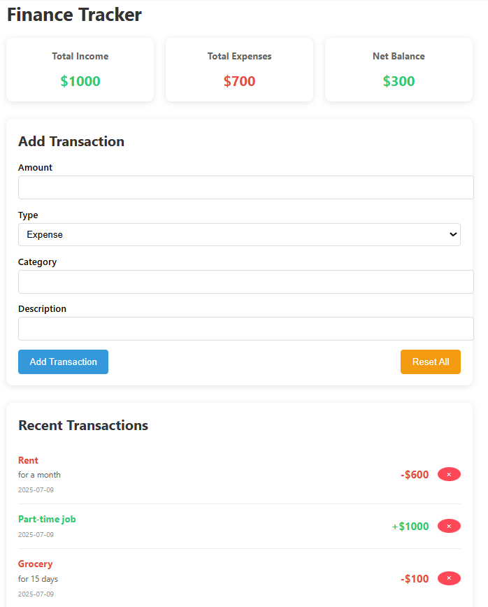

# Finance Tracker

Finance Tracker is a modern, user-friendly web application designed to help individuals monitor income, track expenses, and manage personal budgets with ease. Built using React, the app provides a clean and responsive interface, making financial tracking accessible for everyone from students to professionals seeking better financial control.

---

## Demo



---

## Technologies Used

- **React.js** – Frontend library
- **JavaScript (ES6+)** – Logic & state management
- **HTML/CSS** – Structure and styling
- **LocalStorage** – Data persistence in browser
- **Create React App** – Project scaffolding

---

## Requirements

- Node.js (v18+)
- npm (v9+)

---

## Installation

```bash
git clone https://github.com/your-username/finance-tracker.git
cd finance-tracker
npm install
npm start


